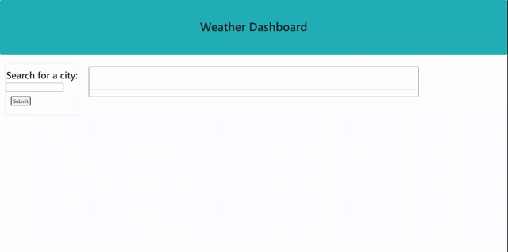

# Weather-dashboard

## Process
For this application, I sought to accomplish multiple objectives:
- Connect a server-side weather API to my own application
- Align certain parameters for the current day, as well as the five-day forecast
- Create a search bar that will populate the weather forecasts when a city is inputted
- Create localStorage functions that will keep those search terms even when the browser is refreshed

With that said, I ran into obstacles. The localStorage would not create buttons that would reshow the weather forecasts. And, my UI proved difficult as the last search would remain on the webpage.

However, this challenge was very difficult and I am ok that I was able to accomplish some basics in accord with the server-side API.

## Languages/Inclusions
- JavaScript Web APIs
- HTML
- Bootstrap CSS
- Server-side APIs
- Method.JS

## Code Snippet
This code snippet represents the function that runs when a city is inputted into the search bar. When this city is inputted, the function fetches the API key and the parameters that were sought. Once the right data parameters are fetched, the weather forecast for that day appears. 

~~~~
function getCurrent(place) {
    // making values for city 
    var city = place
    console.log(city)
    var apiKey = "http://api.openweathermap.org/data/2.5/weather?q=" + city + "&appid=58fb14ad5370b87fc70f19a964d8ea8c&units=imperial"
    var currentTime = moment().format('M/DD/YYYY')
    cityName.textContent = city + '          ' + currentTime

    //fetching data
    fetch(apiKey)
        .then(res => res.json())
        .then(data => {
            console.log(data)

            fetch('https://api.openweathermap.org/data/2.5/onecall?lat=' + data.coord.lat + '&lon=' + data.coord.lon + '&appid=58fb14ad5370b87fc70f19a964d8ea8c&units=imperial')
                .then(res2 => res2.json())
                //adding in current weather data attributes
                .then(data2 => {
                    document.querySelector('#tempcurrent').textContent = "Temperature: " + data2.daily[0].temp.day + "°F"
                    console.log(data2)
                    document.querySelector('#wind').textContent = "Wind Speed: " + data2.daily[0].wind_speed
                    document.querySelector('#humidity').textContent = "Humidity: " + data2.daily[0].humidity + "%"
                    document.querySelector('#uv-index').textContent = "UV Index: " + data2.daily[0].uvi

                    getFuture(data2.daily)
                    storeCity()
                })
        })
}
~~~~
## Gif
